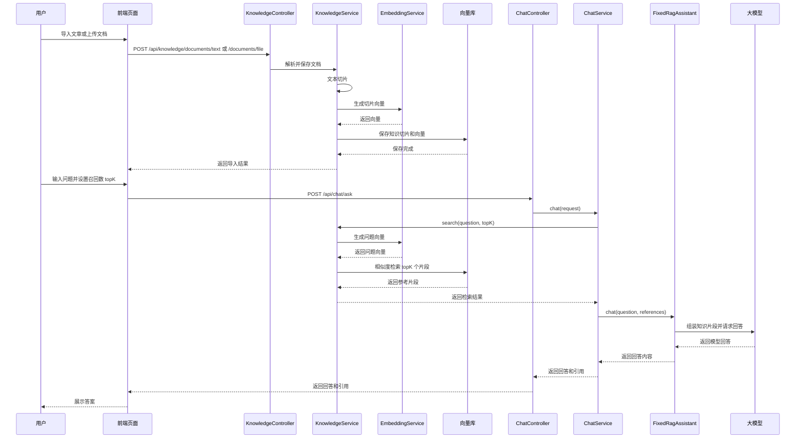

# AI 对答与 RAG Demo

这是第一阶段的小型 Demo，目标是先把“文章切分 → 向量化 → 检索 → 结合模型回答”跑通。

## 项目结构

```text
ai-code-helper
├─ frontend                    前端静态资源
│  ├─ index.html               页面结构
│  ├─ css/index.css            页面样式
│  └─ js
│     ├─ api.js                后端接口请求封装
│     ├─ markdown.js           Markdown 安全渲染
│     └─ app.js                页面交互和业务逻辑
├─ src/main/java               Spring Boot 后端代码
├─ src/main/resources          后端配置文件
└─ pom.xml                     Maven 配置
```

Maven 构建时会将 `frontend` 自动复制到应用的 `static` 目录，因此前后端保存在同一个项目中，运行和打包仍只需要 Spring Boot。

## 已实现

- 一个可直接访问的生活化对答网页
- 粘贴文章导入，以及 `txt` / `md` / `pdf` / `doc` / `docx` 文件解析上传
- 文档列表管理、删除文档及其全部切片、使用原文重新索引
- LangChain4j 递归文档切分（默认 500 字，重叠 80 字）
- 本地哈希向量，未配置 Embedding 服务也能演示
- LangChain4j 内存向量库，以及 Elasticsearch `dense_vector + script_score` 检索
- LangChain4j OpenAI 兼容的 Embedding、Chat Model
- 基于 LangChain4j AI Services 的 Tool Calling Agent，当前提供知识库检索工具
- 基于 `ChatMemoryProvider` 的多会话记忆，并通过 `MessageWindowChatMemory` 限制历史消息数量
- 模型、Embedding、Elasticsearch 均通过 `application.yml` 配置

## 核心流程



## 后端代码阅读顺序

聊天入口统一收敛在 `ChatServiceImpl`，固定 RAG 和 Agent 两条流程都可以从这里顺着阅读：

```text
ChatController
└─ ChatServiceImpl
   ├─ 固定 RAG：KnowledgeService.search → FixedRagAssistant.chat
   └─ Agent：AgentAssistant.chat → KnowledgeSearchTool → KnowledgeService.search
```

`FixedRagAssistant` 和 `AgentAssistant` 只声明 LangChain4j 调用方式，不承载额外业务逻辑；模型、会话记忆和 Tool 的组装统一放在 `LangChain4jConfig`。

## 运行环境

- JDK 17
- Maven 3.6+
- 可选：Elasticsearch 8.x

## 第一次运行（无外部依赖）

```bash
mvn spring-boot:run
```

打开：<http://localhost:3859>

默认配置：

- 模型：调用 `ai.chat` 配置的远程模型
- 向量：`local-hash`
- 向量库：`memory`
- 检索：相似度低于 `ai.retrieval.min-score` 的切片不会参与回答或作为引用返回

先粘贴文章或上传文档，再在左侧提问即可验证完整流程。当前文档元数据和原文保存在内存中，服务重启后文档管理列表会清空；使用内存向量库时，知识切片也会同时清空。

## 接入真实模型

编辑 `src/main/resources/application.yml`：

```yaml
ai:
  chat:
    url: "https://your-host/v1/chat/completions"
    api-key: "your-api-key"
    model: "your-model"
```

模型调用由 LangChain4j `OpenAiChatModel` 负责，`url` 可以继续填写完整的 OpenAI 兼容 `chat/completions` 地址。

## 接入真实 Embedding

```yaml
ai:
  embedding:
    url: "https://your-host/v1/embeddings"
    api-key: "your-api-key"
    model: "your-embedding-model"
    dimensions: 1024
```

`dimensions` 必须与模型实际返回的向量维度一致。更换维度后，如果 Elasticsearch 中已经创建旧索引，需要新建索引名或人工删除旧测试索引后重建。

`local-hash` 仅用于本地演示，不具备完整的语义理解能力。该模式默认还会进行关键词重合校验，以减少哈希碰撞导致的不相关召回；接入真实 Embedding 后只使用相似度阈值过滤。

## 会话记忆

前端会为每次新对话生成独立的 `conversationId`，后端通过 LangChain4j `ChatMemoryProvider` 隔离不同会话。点击“清空对话”时会生成新的会话标识。

```yaml
ai:
  chat-memory:
    max-messages: 20
```

`max-messages` 表示每个会话最多保留的消息数量，包含用户、助手和工具消息。当前记忆保存在服务内存中，应用重启后会清空。

## 接入测试线 Elasticsearch

```yaml
elasticsearch:
  enabled: true
  url: "http://your-es-host:9200"
  username: ""
  password: ""
  index-name: "ai_knowledge_chunk"
```

服务会在首次导入文章时自动创建索引。当前使用兼容 Elasticsearch 8.x 的 `dense_vector` 映射和 `cosineSimilarity` 脚本评分，不绑定特定 Java ES 客户端版本。

## 示例：

```bash
curl -X POST http://localhost:3859/api/knowledge/documents/text \
  -H "Content-Type: application/json" \
  -d '{"title":"雨天晾衣","content":"下雨天可以使用风扇或空调除湿模式加快衣服干燥。"}'

curl -X POST http://localhost:3859/api/chat/ask \
  -H "Content-Type: application/json" \
  -d '{"conversationId":"demo-session-1","question":"下雨天衣服不干怎么办？","topK":4}'
```

重新索引时会先完成新切片的向量生成，再删除并替换旧切片。启用 Elasticsearch 后，删除操作通过 `_delete_by_query` 按 `documentId` 清理索引数据。

## Agent 模式

可在 `application.yml` 中切换固定 RAG 和 Agent 流程。开启 Agent 前，请确认模型接口支持 OpenAI 兼容的 `tools`、`tool_choice` 和 `tool_calls` 协议：

```yaml
agent:
  enabled: true
  max-steps: 5
  trace-enabled: true
```

LangChain4j AI Services 会负责工具定义、参数解析和多轮调用。Agent 会自主判断是否调用 `knowledge_search`：普通问题可以直接回答，需要内部资料的问题则会检索知识库，并根据工具结果继续生成最终回答。

`/api/chat/ask` 的请求和响应格式保持不变。将 `agent.enabled` 改回 `false`，即可回退到固定 RAG 流程。
