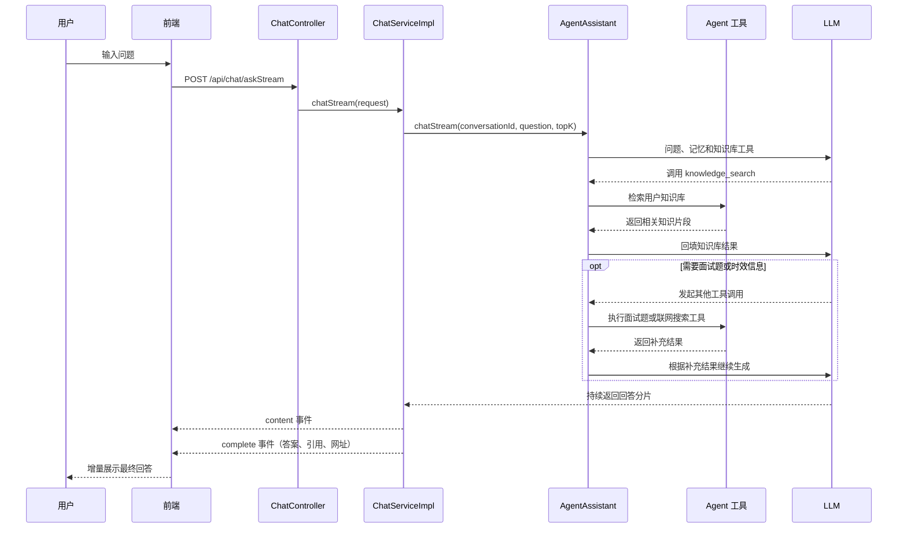

# AI Agent 与知识库 Demo

这是一个基于 Spring Boot 和 LangChain4j 的 AI Agent Demo，支持同步/流式问答、会话记忆、知识库检索、面试题搜索和 MCP 联网搜索。

前后端保存在同一个 Maven 项目中。构建时会将 `frontend` 目录复制到应用的 `static` 目录，启动 Spring Boot 后即可直接访问页面。

## 技术栈

- JDK 17、Spring Boot 3.5.3
- LangChain4j 1.19.0
- LangChain4j Reactor / MCP 1.19.0-beta29
- OpenAI Chat Completions 兼容模型
- Server-Sent Events（SSE）流式输出
- 内存向量库或 Elasticsearch 8.x
- 原生 HTML、CSS、JavaScript

## 已实现

- 同步问答接口和基于 `Flux` 的 SSE 流式问答接口，页面可切换输出模式
- 基于 `ChatMemoryProvider` 的多会话记忆
- TXT、Markdown、PDF、DOC、DOCX 文件解析，以及文本直接导入
- LangChain4j 递归文档切分，默认切片长度 500、重叠长度 80
- LangChain4j AI Services Tool Calling Agent
- `knowledge_search` 知识库检索工具
- `interviewQuestionSearch` 面试题搜索工具
- 基于智谱 Streamable HTTP MCP 的联网搜索工具
- 输入、输出 Guardrails 安全检查
- 模型请求、响应、Token、耗时、工具调用和异常日志监听
- Markdown 安全渲染、知识引用和相关网页展示

## 项目结构

```text
ai-rag-demo
├─ frontend
│  ├─ index.html               页面结构
│  ├─ css/index.css            页面样式
│  └─ js
│     ├─ api.js                HTTP 与 SSE 底层请求封装
│     ├─ route.js              后端接口调用
│     ├─ elements.js           DOM 元素引用
│     ├─ ui.js                 通用页面交互
│     ├─ chat.js               对话与流式响应处理
│     ├─ knowledge.js          知识库管理
│     ├─ markdown.js           Markdown 安全渲染
│     └─ app.js                页面初始化入口
├─ src/main/java/com/eastmoney/agent
│  ├─ config                   模型、MCP 和请求转换配置
│  ├─ controller               对答与知识库接口
│  ├─ guardrail                输入、输出安全检查
│  ├─ listener                 模型调用日志监听
│  ├─ reference                知识引用和网页链接处理
│  ├─ service                  Agent 与业务服务
│  ├─ tool                     Agent 本地工具
│  └─ vo                       请求和响应对象
├─ src/main/resources
│  ├─ prompts                  Agent 系统提示词
│  └─ application.yml          应用配置
└─ pom.xml                     Maven 配置
```

## 核心流程

前端默认开启流式输出，也可以通过页面开关切换为同步调用。流式模式下，后端把模型分片转换为 SSE 事件，并在生成结束后返回知识库引用和相关网页。



后端聊天代码建议按下面的顺序阅读：

```text
流式：ChatController.askStream
   └─ ChatServiceImpl.chatStream
      └─ AgentAssistant.chatStream → TokenStream → Agent 工具

同步：ChatController.ask
   └─ ChatServiceImpl.chat
      └─ AgentAssistant.chat → Result<String> → Agent 工具
```

同步模型、流式模型、会话记忆、本地工具和 MCP 工具统一在 `LangChain4jConfig` 中组装。

## 运行前配置

聊天模型和智谱 MCP 是当前启动所需配置。请修改 `src/main/resources/application.yml`，不要将真实密钥提交到代码仓库。

### 聊天模型

```yaml
ai:
  chat:
    base_url: "https://your-host/v1/chat/completions"
    api-key: "your-api-key"
    model: "your-model"
  chat-memory:
    max-messages: 20
```

`base_url` 支持填写 OpenAI 兼容服务的基础地址，也支持填写包含 `/chat/completions` 的完整地址。项目会同时创建 `OpenAiChatModel` 和 `OpenAiStreamingChatModel`：同步接口使用前者，SSE 接口使用后者。


### Agent

```yaml
agent:
  max-steps: 5
  trace-enabled: true
```

- `max-steps`：单次任务允许的最大工具调用轮数。
- `trace-enabled`：是否记录模型请求、响应、Token、耗时和工具调用摘要。


### 智谱联网搜索 MCP

```yaml
bigmodel:
  api-key: "your-coding-plan-api-key"
  mcp:
    web-search-url: "https://open.bigmodel.cn/api/mcp/web_search_prime/mcp"
    log-enabled: false
```

项目通过 Streamable HTTP 协议连接智谱 Web Search Prime MCP，并将服务端提供的工具注册到 Agent。当前 `McpConfig` 会在启动时创建客户端，因此必须配置有效的 GLM Coding Plan API Key，并保证 MCP 服务可访问，否则应用会启动失败。

涉及最新动态、实时信息或外部事实核验的问题，Agent 会优先使用联网搜索工具。`log-enabled` 仅建议在调试 MCP 请求时开启。

#### 智谱Token plan：
https://bigmodel.cn/coding-plan/personal/overview
#### 智谱余额总览：
https://bigmodel.cn/finance-center/finance/overview
#### 智谱本地 MCP 服务:
https://mcp.so/servers/cc-zhipu-web-search
#### 智谱远程 MCP 服务:
https://docs.bigmodel.cn/cn/coding-plan/mcp/search-mcp-server

### Embedding 与向量存储

不配置远程 Embedding 地址时，项目使用本地 256 维哈希向量：

```yaml
ai:
  embedding:
    url: ""
    api-key: ""
    model: ""
    dimensions: 256
  chunk:
    size: 500
    overlap: 80
  retrieval:
    min-score: 0.50
    local-keyword-filter-enabled: true
```

接入 OpenAI 兼容的 Embedding 服务时填写：

```yaml
ai:
  embedding:
    url: "https://your-host/v1/embeddings"
    api-key: "your-api-key"
    model: "your-embedding-model"
    dimensions: 1024
```

`dimensions` 必须与模型实际返回的向量维度一致。本地哈希向量仅用于演示，不具备完整语义理解能力，因此默认还会进行关键词重合校验。

默认使用内存向量库。接入 Elasticsearch 8.x 时配置：

```yaml
elasticsearch:
  enabled: true
  url: "http://your-es-host:9200"
  username: ""
  password: ""
  index-name: "ai_knowledge_chunk"
```

服务会在首次导入文档时自动创建索引。更换向量维度后，如果 Elasticsearch 中已经存在旧索引，需要更换索引名或清理旧测试索引后重建。

## 启动项目

确认聊天模型和 MCP 配置可用后运行：

```bash
mvn spring-boot:run
```

浏览器访问：<http://localhost:3859>

当前文档元数据和原文保存在应用内存中，服务重启后文档列表会清空。使用内存向量库时，知识切片也会同时清空。

## 接口说明

### 对答接口

| 方法 | 路径 | 说明 |
| --- | --- | --- |
| POST | `/api/chat/askStream` | SSE 流式问答，前端默认使用 |
| POST | `/api/chat/ask` | 同步问答，保留用于普通 HTTP 调用 |

两个接口使用相同的请求参数：

```json
{
  "conversationId": "demo-session-1",
  "question": "下雨天衣服不干怎么办？",
  "topK": 4
}
```

`conversationId` 用于隔离会话记忆，`topK` 默认值为 4。


### 知识库接口

| 方法 | 路径 | 说明 |
| --- | --- | --- |
| POST | `/api/knowledge/documents/text` | 导入标题和文本内容 |
| POST | `/api/knowledge/documents/file` | 上传 TXT、MD、PDF、DOC 或 DOCX 文件 |
| GET | `/api/knowledge/documents` | 查询文档列表 |
| GET | `/api/knowledge/documents/{documentId}` | 查询文档详情 |
| POST | `/api/knowledge/documents/{documentId}/delete` | 删除文档及其切片 |
| POST | `/api/knowledge/documents/{documentId}/reindex` | 使用原文重新生成切片和索引 |
| GET | `/api/knowledge/chunks/search` | 直接检索知识切片 |
| GET | `/api/knowledge/status` | 查询 Embedding 和向量库运行模式 |

## 调用示例

1. 导入一篇文本：

```bash
curl -X POST http://localhost:3859/api/knowledge/documents/text \
  -H "Content-Type: application/json" \
  -d '{"title":"雨天晾衣","content":"下雨天可以使用风扇或空调除湿模式加快衣服干燥。"}'
```

2. 使用 SSE 流式提问：

```bash
curl -N -X POST http://localhost:3859/api/chat/askStream \
  -H "Content-Type: application/json" \
  -d '{"conversationId":"demo-session-1","question":"下雨天衣服不干怎么办？","topK":4}'
```

3. 同步接口调用：

```bash
curl -X POST http://localhost:3859/api/chat/ask \
  -H "Content-Type: application/json" \
  -d '{"conversationId":"demo-session-1","question":"下雨天衣服不干怎么办？","topK":4}'
```

重新索引时会先完成新切片的向量生成，再删除并替换旧切片。启用 Elasticsearch 后，删除操作通过 `_delete_by_query` 按 `documentId` 清理索引数据。
