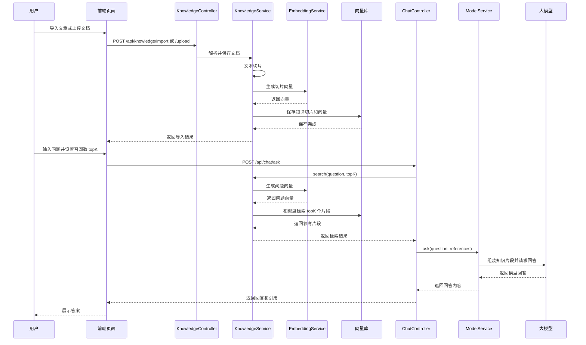

# AI 对答与 RAG Demo

这是第一阶段的小型 Demo，目标是先把“文章切分 → 向量化 → 检索 → 结合模型回答”跑通。

## 项目结构

```text
ai-rag-demo
├─ frontend                    前端静态资源
│  ├─ index.html               页面结构
│  ├─ css/index.css            页面样式
│  └─ js
│     ├─ api.js                后端接口请求封装
│     ├─ markdown.js           Markdown 安全渲染
│     └─ app.js                页面交互和业务逻辑
├─ src/main/java               Spring Boot 后端代码
├─ src/main/resources          后端配置文件
└─ pom.xml                     Maven 配置
```

Maven 构建时会将 `frontend` 自动复制到应用的 `static` 目录，因此前后端保存在同一个项目中，运行和打包仍只需要 Spring Boot。

## 已实现

- 一个可直接访问的生活化对答网页
- 粘贴文章导入，以及 `txt` / `md` / `pdf` / `doc` / `docx` 文件解析上传
- 文档列表管理、删除文档及其全部切片、使用原文重新索引
- 定长重叠文档切分（默认 500 字，重叠 80 字）
- 本地哈希向量，未配置 Embedding 服务也能演示
- Elasticsearch `dense_vector + script_score` 检索
- OpenAI 兼容的 Embedding、Chat Completions 接口
- 模型、Embedding、Elasticsearch 均通过 `application.yml` 配置

## 核心流程



## 运行环境

- JDK 8+
- Maven 3.6+
- 可选：Elasticsearch 8.x

## 第一次运行（无外部依赖）

```bash
mvn spring-boot:run
```

打开：<http://localhost:3859>

默认配置：

- 模型：调用 `ai.chat` 配置的远程模型
- 向量：`local-hash`
- 向量库：`memory`

先粘贴文章或上传文档，再在左侧提问即可验证完整流程。当前文档元数据和原文保存在内存中，服务重启后文档管理列表会清空；使用内存向量库时，知识切片也会同时清空。

## 接入真实模型

编辑 `src/main/resources/application.yml`：

```yaml
ai:
  chat:
    url: "https://your-host/v1/chat/completions"
    api-key: "your-api-key"
    model: "your-model"
```

接口按 OpenAI Chat Completions 的 `choices[0].message.content` 格式解析。

## 接入真实 Embedding

```yaml
ai:
  embedding:
    url: "https://your-host/v1/embeddings"
    api-key: "your-api-key"
    model: "your-embedding-model"
    dimensions: 1024
```

`dimensions` 必须与模型实际返回的向量维度一致。更换维度后，如果 Elasticsearch 中已经创建旧索引，需要新建索引名或人工删除旧测试索引后重建。

## 接入测试线 Elasticsearch

```yaml
elasticsearch:
  enabled: true
  url: "http://your-es-host:9200"
  username: ""
  password: ""
  index-name: "ai_knowledge_chunk"
```

服务会在首次导入文章时自动创建索引。当前使用兼容 Elasticsearch 8.x 的 `dense_vector` 映射和 `cosineSimilarity` 脚本评分，不绑定特定 Java ES 客户端版本。

## 示例：

```bash
curl -X POST http://localhost:3859/api/knowledge/import \
  -H "Content-Type: application/json" \
  -d '{"title":"雨天晾衣","content":"下雨天可以使用风扇或空调除湿模式加快衣服干燥。"}'

curl -X POST http://localhost:3859/api/chat/ask \
  -H "Content-Type: application/json" \
  -d '{"question":"下雨天衣服不干怎么办？","topK":4}'
```

重新索引时会先完成新切片的向量生成，再删除并替换旧切片。启用 Elasticsearch 后，删除操作通过 `_delete_by_query` 按 `documentId` 清理索引数据。
