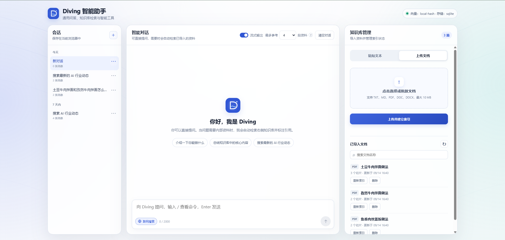
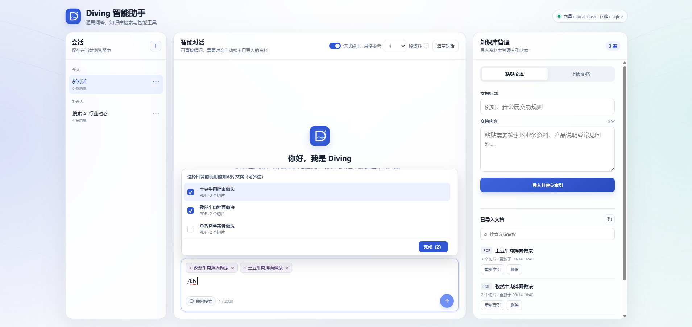
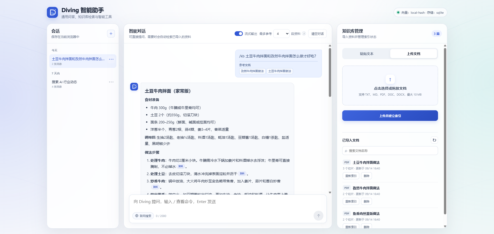
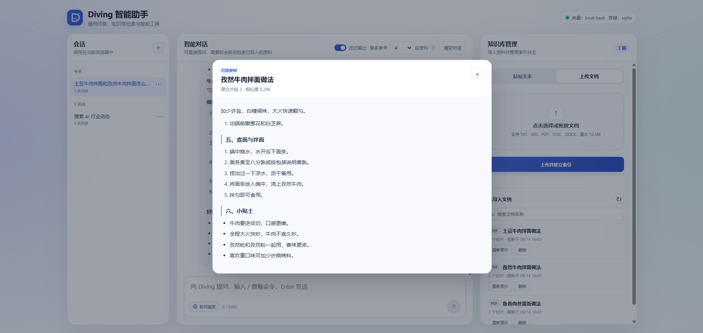
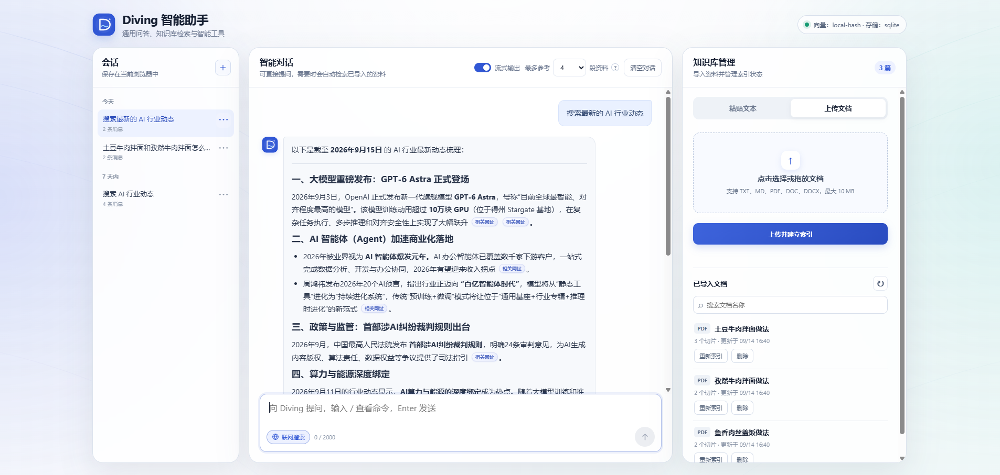
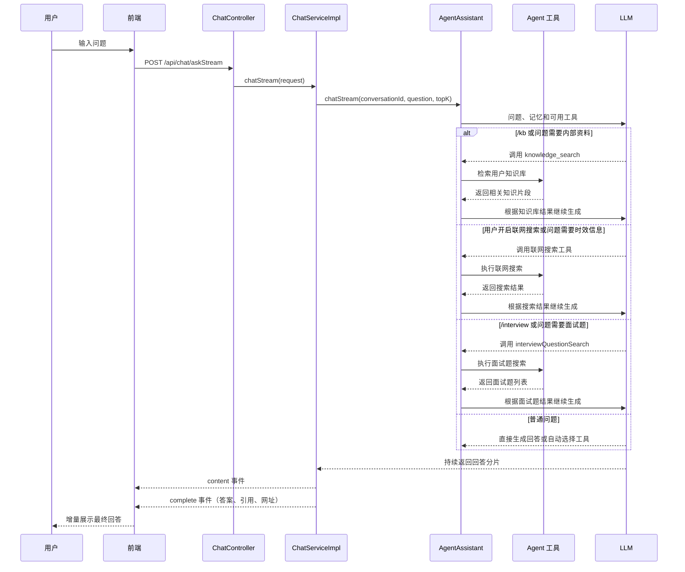

# AI Agent 与知识库 Demo

这是一个基于 Spring Boot 和 LangChain4j 开发的 AI Agent Demo，主要用于演示大模型对话、Agent 工具调用和 RAG 知识库检索的完整实现。项目目前优先适配 DeepSeek 及其兼容网关，支持同步/流式问答、多会话记忆、知识库检索、面试题搜索、MCP 联网搜索、输入输出安全检查以及回答引用展示。


项目采用前后端一体化结构，后端提供 Agent 编排、模型调用、知识检索和数据存储能力，前端使用原生 HTML、CSS、JavaScript 实现对话与知识库管理页面。

## 功能预览

### 1.智能问答



### 2.知识库检索

选择一个或多个已导入文档，限定本次问答使用的知识库范围：



Agent 根据指定文档检索相关片段并生成带引用标记的回答：



点击回答中的引用标记，可以查看实际支持回答的知识库原文片段：



### 3.联网搜索

启用智谱 Web Search Prime MCP 后，页面输入框会显示“联网搜索”开关。

联网搜索结果会作为工具调用结果交给模型整理。最终回答会在对应事实后保留可点击的来源链接，并展示相关网页，方便继续查看和核验原始信息：



## 技术栈

- JDK 17、Spring Boot 3.5.3
- LangChain4j 1.19.0
- LangChain4j Reactor / MCP 1.19.0-beta29
- OpenAI Chat Completions 兼容模型
- Server-Sent Events（SSE）流式输出
- SQLite 本地向量存储或 Elasticsearch 8.x
- 原生 HTML、CSS、JavaScript

## 已实现

- 同步问答接口和基于 `Flux` 的 SSE 流式问答接口，页面可切换输出模式
- 基于 `ChatMemoryProvider` 的多会话记忆
- 浏览器本地保存多个会话的标题和展示消息，刷新后可恢复并切换
- TXT、Markdown、PDF、DOC、DOCX 文件解析，以及文本直接导入
- LangChain4j 递归文档切分，默认切片长度 500、重叠长度 80
- LangChain4j AI Services Tool Calling Agent
- `knowledge_search` 知识库检索工具
- `interviewQuestionSearch` 面试题搜索工具
- 基于智谱 Streamable HTTP MCP 的联网搜索工具
- 输入、输出 Guardrails 安全检查
- 模型请求、响应、Token、耗时、工具调用和异常日志监听
- Markdown 安全渲染、知识引用和相关网页展示

## 项目结构

```text
ai-rag-demo
├─ frontend
│  ├─ index.html               页面结构
│  ├─ css/index.css            页面样式
│  └─ js
│     ├─ api.js                HTTP 与 SSE 底层请求封装
│     ├─ commands.js           斜杠命令定义与解析
│     ├─ conversation-store.js 会话列表和展示消息的本地持久化
│     ├─ route.js              后端接口调用
│     ├─ elements.js           DOM 元素引用
│     ├─ ui.js                 通用页面交互
│     ├─ chat.js               对话与流式响应处理
│     ├─ knowledge.js          知识库管理
│     ├─ markdown.js           Markdown 安全渲染
│     └─ app.js                页面初始化入口
├─ src/main/java/com/eastmoney/agent
│  ├─ config                   模型和 MCP 配置
│  ├─ controller               对答与知识库接口
│  ├─ guardrail                输入、输出安全检查
│  ├─ listener                 模型调用日志监听
│  ├─ reference                知识引用和网页链接处理
│  ├─ service                  Agent 与业务服务
│  ├─ tool                     Agent 本地工具
│  ├─ transformer              Agent 请求工具路由
│  ├─ enums                    命令和业务枚举
│  └─ vo                       请求和响应对象
├─ src/main/resources
│  ├─ prompts                  Agent 系统提示词
│  └─ application.yml          应用配置
└─ pom.xml                     Maven 配置
```

## 核心流程

前端默认开启流式输出，也可以通过页面开关切换为同步调用。流式模式下，后端把模型分片转换为 SSE 事件，并在生成结束后返回知识库引用和相关网页。




## 运行前配置

聊天模型是项目启动所需配置，智谱 MCP 联网搜索默认关闭、按需开启。

### 聊天模型

```yaml
ai:
  chat:
    base_url: "https://your-host/v1/chat/completions"
    api-key: "your-api-key"
    model: "your-model"
    thinking-enabled: false
  chat-memory:
    max-messages: 20
```

当前项目优先适配 DeepSeek 及其兼容网关，并以 DeepSeek 模型完成主要功能验证。

`base_url` 支持填写服务基础地址，也支持填写包含 `/chat/completions` 的完整地址。项目会同时创建 `OpenAiChatModel` 和 `OpenAiStreamingChatModel`：同步接口使用前者，SSE 接口使用后者。

其他模型只有在兼容 OpenAI Chat Completions 协议时才可能接入，目前未做完整兼容性验证，工具调用、`tool_choice`、thinking 参数和 SSE 流式响应等行为可能存在差异。

`thinking-enabled` 默认为 `false`，用于关闭 DeepSeek thinking，避免思考模式与 Agent 工具调用冲突；使用其他模型时需要根据对应服务的接口能力自行调整和验证。


### Agent

```yaml
agent:
  max-steps: 5
  trace-enabled: true
```

- `max-steps`：单次任务允许的最大工具调用轮数。
- `trace-enabled`：是否记录模型请求、响应、Token、耗时和工具调用摘要。


### 智谱联网搜索 MCP

```yaml
bigmodel:
  enabled: false
  api-key: "your-coding-plan-api-key"
  mcp:
    web-search-url: "https://open.bigmodel.cn/api/mcp/web_search_prime/mcp"
    log-enabled: false
```

项目通过 Streamable HTTP 协议连接智谱 Web Search Prime MCP，并将服务端提供的工具注册到 Agent。`enabled` 默认为 `false`，关闭或未配置整个 `bigmodel` 节点时不会创建 MCP 客户端，应用可以正常启动，页面也不会展示“联网搜索”按钮。需要使用时将其改为 `true`，并配置有效的 GLM Coding Plan API Key 和 MCP 地址。

涉及最新动态、实时信息或外部事实核验的问题，Agent 会自动选择联网搜索工具。`log-enabled` 仅建议在调试 MCP 请求时开启。

#### 智谱Token plan：
https://bigmodel.cn/coding-plan/personal/overview
#### 智谱余额总览：
https://bigmodel.cn/finance-center/finance/overview
#### 智谱本地 MCP 服务:
https://mcp.so/servers/cc-zhipu-web-search
#### 智谱远程 MCP 服务:
https://docs.bigmodel.cn/cn/coding-plan/mcp/search-mcp-server

### Embedding 与向量存储

不配置远程 Embedding 地址时，项目使用本地 256 维哈希向量：

```yaml
ai:
  embedding:
    url: ""
    api-key: ""
    model: ""
    dimensions: 256
  chunk:
    size: 500
    overlap: 80
  retrieval:
    min-score: 0.50
    local-keyword-filter-enabled: true
```

接入 OpenAI 兼容的 Embedding 服务时填写：

```yaml
ai:
  embedding:
    url: "https://your-host/v1/embeddings"
    api-key: "your-api-key"
    model: "your-embedding-model"
    dimensions: 1024
```

`dimensions` 必须与模型实际返回的向量维度一致。本地哈希向量仅用于演示，不具备完整语义理解能力，因此默认还会进行关键词重合校验。

默认使用本地 SQLite 存储：文档、切片、JSON 向量以及会话记忆保存在 `data/knowledge.db`；向量检索时由 Java 计算余弦相似度。

接入 Elasticsearch 8.x 时配置：

```yaml
elasticsearch:
  enabled: true
  url: "http://your-es-host:9200"
  username: ""
  password: ""
  index-name: "ai_knowledge_chunk"
```

服务会在首次导入文档时自动创建索引。更换向量维度后，如果 Elasticsearch 中已经存在旧索引，需要更换索引名或清理旧测试索引后重建。

## 启动项目

确认聊天模型和 MCP 配置可用后运行：

```bash
mvn spring-boot:run
```

浏览器访问：<http://localhost:3859>

默认情况下，文档元数据、原文、切片、JSON 向量和 Agent 聊天记忆保存在 `data/knowledge.db`，服务重启后仍可沿用原会话。页面侧的会话标题和展示消息保存在当前浏览器的 `localStorage` 中，用于刷新后恢复会话列表。`chat-memory.max-messages` 控制每个会话持久化的消息窗口大小。

## 斜杠命令

在聊天输入框中输入 `/` 会显示命令菜单：

| 命令 | 说明 |
| --- | --- |
| `/auto 问题` | 由 Agent 根据问题自动选择是否使用工具 |
| `/kb 问题` | 多选已导入文档，仅根据所选知识库范围回答 |
| `/interview 关键词` | 仅搜索相关技术面试题 |
| `/skills` | 查看 Diving 当前可使用的能力 |
| `/help` | 查看全部斜杠命令及说明 |

选择 `/kb` 后，页面会显示已导入文档，可同时选择多个文档。所选文档会以标签形式显示在输入框上方，本次检索只会在这些文档中进行。


## 调用示例

1. 导入一篇文本：

```bash
curl -X POST http://localhost:3859/api/knowledge/documents/text \
  -H "Content-Type: application/json" \
  -d '{"title":"雨天晾衣","content":"下雨天可以使用风扇或空调除湿模式加快衣服干燥。"}'
```

2. 使用 SSE 流式提问：

```bash
curl -N -X POST http://localhost:3859/api/chat/askStream \
  -H "Content-Type: application/json" \
  -d '{"conversationId":"demo-session-1","question":"下雨天衣服不干怎么办？","topK":4}'
```

3. 同步接口调用：

```bash
curl -X POST http://localhost:3859/api/chat/ask \
  -H "Content-Type: application/json" \
  -d '{"conversationId":"demo-session-1","question":"下雨天衣服不干怎么办？","topK":4}'
```

重新索引时会先完成新切片的向量生成，再删除并替换旧切片。启用 Elasticsearch 后，删除操作通过 `_delete_by_query` 按 `documentId` 清理索引数据。
